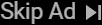

# Python-YouTube-Skip-Ads-Application
This Python application allows you to skip advertisements while watching YouTube videos automatically. It provides a convenient way to enhance your YouTube viewing experience by automatically detecting and skipping ads without any manual intervention.

 <h3> 🚀 Features:</h3>
- Automatic Ad Detection: The application uses intelligent algorithms to detect ads during YouTube video playback. 
- Ad Skipping: Once an ad is detected, the application automatically skips it and resumes playing the actual video content. 
- Seamless Integration: The application integrates smoothly with your existing YouTube playback experience, ensuring minimal disruption. 
- User-Friendly Interface: The application provides a simple and intuitive user interface, making it easy to configure and use. 
- Cross-Platform Compatibility: The application is developed using Python, making it compatible with various operating systems, including Windows, macOS, and Linux.

<h3>Demo and Screenshots:</h3>
To get a better understanding of the application and its functionality, check out the "demo" folder in the repository. It contains a video demonstration of the application in action, as well as screenshots showcasing different features and settings.
 

<h3 align="center"> Gui Application  </h3>
 
The YouTube Skip Ads GUI application is characterized by its simplicity, providing an intuitive interface to enhance your YouTube viewing experience. It consists of five buttons:

1. **Start** : Click this button to start the application and enable automatic ad detection and skipping. 

2. **End** : Use this button to stop the application and disable ad detection and skipping. It allows you to return to normal YouTube playback. 

3. **Exit**: Click this button to close the application window and exit the program. 

4. **Minimize Window**: This button allows you to minimize the application window, reducing it to the taskbar while the application continues running in the background. 

5. **Maximize Window**: Use this button to maximize the application window, enlarging it to fit your screen for a better viewing experience. 

With this user-friendly interface and these intuitive buttons, the YouTube Skip Ads GUI application simplifies the process of skipping advertisements during your YouTube video playback. 
  
 

</img>
 

 
<h3 align="center"> How It Works  </h3>
 
The YouTube Skip Ads Python application utilizes advanced techniques to automatically detect and skip advertisements while watching YouTube videos. Here's how it works: 

1. **Detection**: The program continuously analyzes the video frames for the presence of ad images or logos commonly associated with skip ads. It intelligently identifies these visual cues within the video. 

2. **Skip Trigger**: Once an ad image or logo is detected, the program waits for a mouse movement event. This allows you to have full control over skipping ads without any false positives. It ensures that the video is not unintentionally skipped. 

3. **Skip Action**: When you move the mouse, the program recognizes this action as your intention to skip the ad. As a result, the program immediately skips the ad and resumes playing the actual video content, providing you with an uninterrupted viewing experience. 

By combining advanced image detection algorithms with user-triggered actions, the YouTube Skip Ads Python application simplifies the process of skipping ads on any YouTube video with ads. You can enjoy your videos without the hassle of manually navigating through advertisements.
 

</img>
</img>
 

<h3>📚 Getting Started:</h3>
1. Clone the repository to your local machine. 
2. Install the required dependencies i wil added to the README file ASAP bt basically make sure you installed python and it exists in your environment variables. 
3. Run the Python code directly using Python I used Visual Studio Code IDE but you can use any IDE as you wish. 
 
Alternatively, you can use the pre-compiled .exe application for a simplified experience: 
1. Download the Project Folder. 
2. Extract the contents of the .rar folder to a desired location on your computer. 
3. Open the extracted folder then open "\YouTube Skip Adds App python\project\output\gui\gui.exe" 
4. run the executable file (.exe) and enjoy! 🎉. 

<h3>💡 Contributing:</h3>
Contributions to this project are welcome! If you encounter any bugs, have feature requests, or want to improve the application, feel free to open an issue or submit a pull request. 

 
🔥 Start enjoying ad-free YouTube videos with the YouTube Skip Ads Python Application today! Feel free to star the repository and share it with others who might find it useful.🔥
